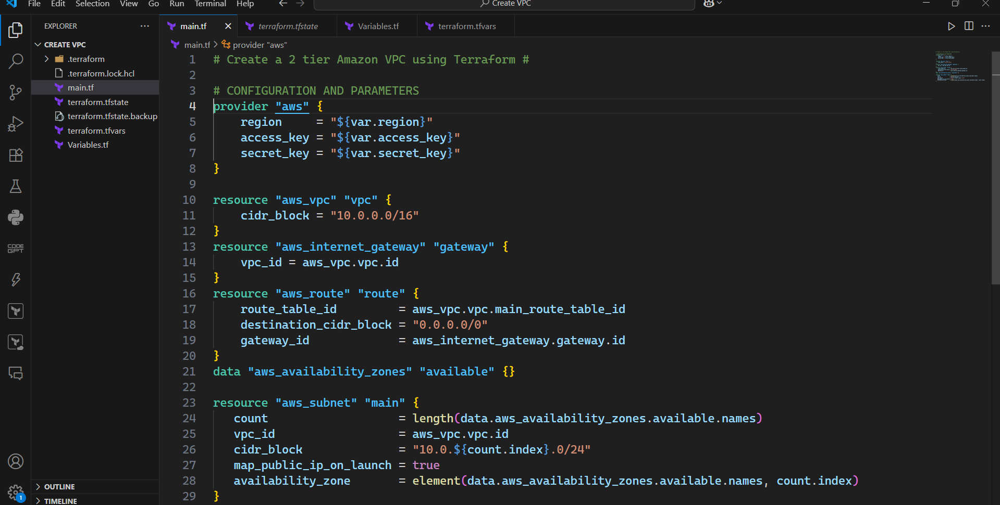
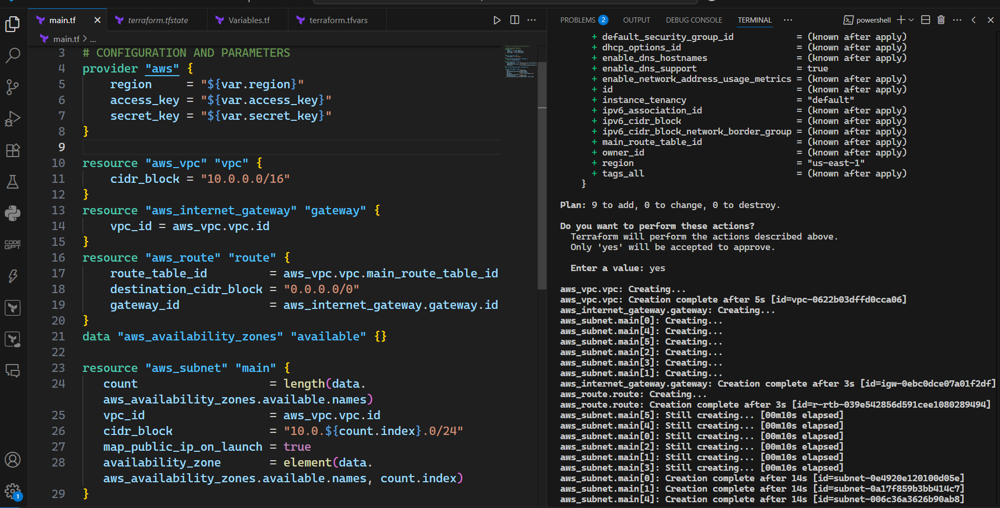
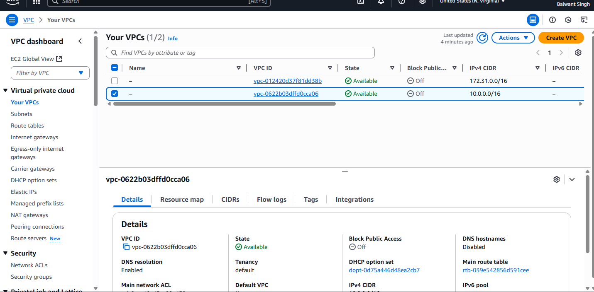

Great 🚀 Here’s a **complete `README.md` file** for your Terraform project (**Creating and Destroying a VPC**) that you can directly upload to GitHub:

---

# 🌐 Create & Destroy VPC using Terraform  

This project demonstrates how to **create and destroy an AWS VPC** using **Terraform**, showcasing Infrastructure as Code (IaC) practices. It is a beginner-friendly yet powerful use case that highlights automation, reproducibility, and scalability in cloud infrastructure management.  

---

## 📌 Project Overview  
- ✅ Automates the creation of a **Virtual Private Cloud (VPC)** in AWS.  
- ✅ Configures **subnets, internet gateway, and route tables**.  
- ✅ Supports **terraform apply** (to create resources) and **terraform destroy** (to remove resources).  
- ✅ Demonstrates the use of **variables, providers, and resource blocks** in Terraform.  
- ✅ Helps beginners understand the **end-to-end IaC workflow**.  

---

## ⚙️ Tech Stack  
- **Terraform** – Infrastructure as Code tool  
- **AWS** – Cloud platform  
- **HCL (HashiCorp Configuration Language)** – Used for writing Terraform scripts  

---

## 📂 Project Structure  


📁 terraform-vpc-project
┣ 📄 main.tf        # Contains VPC, subnet, and route table definitions
┣ 📄 variables.tf   # Input variables for reusability
┣ 📄 outputs.tf     # Output values (e.g., VPC ID)
┣ 📄 provider.tf    # AWS provider configuration
┗ 📄 README.md      # Project documentation


---

## 🚀 How to Use  

### 1️⃣ Clone the Repository  
```
git clone https://github.com/your-username/terraform-vpc-project.git
cd terraform-vpc-project
````

### 2️⃣ Initialize Terraform

```
terraform init
```

### 3️⃣ Plan the Infrastructure

```
terraform plan
```

### 4️⃣ Apply the Changes (Create VPC)

```
terraform apply -auto-approve
```

### 5️⃣ Destroy the Infrastructure (Tear Down VPC)

```
terraform destroy -auto-approve
```

---

## 🖼️ Screenshots

Here are some screenshots of the project in action:

| Terraform Plan                            | Terraform Apply                             | AWS Console VPC                       |
| ----------------------------------------- | ------------------------------------------- | ------------------------------------- |
|  |  |  |

*(Replace with your actual uploaded screenshots in the `screenshots/` folder.)*

---

## 📖 Key Learnings

* Understanding **Terraform basics** (init, plan, apply, destroy)
* Building a **reusable VPC module**
* Gaining hands-on experience with **AWS networking**
* Following best practices in **Infrastructure as Code (IaC)**

---

## 🔮 Future Enhancements

* Add **private subnets & NAT Gateway**
* Implement **security groups and NACLs**
* Expand into **multi-AZ architecture**
* Deploy EC2 instances within the VPC

---

## 👨‍💻 Author

**Balwant Singh**

* 🌐 [LinkedIn](https://www.linkedin.com/in/balwant-singh-aa024b37b/)
* 💻 [GitHub](https://github.com/balwant2711)

---

## ⭐ Contribute

Want to make this project better? Fork it, improve it, and submit a PR. Contributions are welcome!

---

## 📜 License

This project is licensed under the **MIT License** – feel free to use and modify.

```

---


